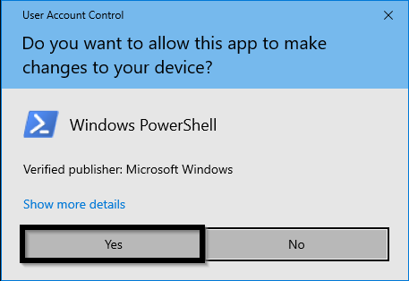
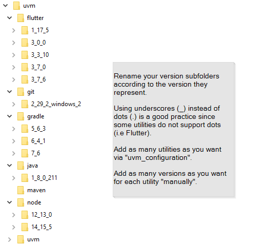

# Welcome to Utility Version Manager (uvm)

## Description
This is a simple project to help developers manage versioning for as many Utilities as they need:
- Add/Remove Utilities (Languages, Frameworks, ...)
- Manage multiple versions for each utility  

Currently project is for **Windows** users only.

## Downloads

| Version         | Download                                                                 |
| :-------------- | :----------------------------------------------------------------------- |
| all versions    | [all releases (zip)](https://github.com/Panaith/uvm.github.io/releases)  |

## Commands
Once the uvm project is installed, open terminal (cmd, powershell) and execute any of the following commands:

| Command               | Chapter                                                  |
| :-------------------- | :------------------------------------------------------- |
| uvm_version           | [Version](#version-uvm_version)                     |
| uvm_install           | [Installation](#installation-uvm_install)                |
| uvm_configuration     | [Configuration](#configuration-uvm_configure)            |
| uvm_use               | [Usage](#usage-uvm_use)                           |

## Installation (uvm_install)
This process creates installation folder for uvm project.
1. Download latest [release](https://github.com/Panaith/uvm.github.io/releases/latest).
1. Extract .zip file.
1. Open extracted folder find "uvm_install.bat" file and execute it.
1. Click "Yes" in Powershell prompt:
   
1. Follow instructions...

### What happens
1. This process will create the installation directory "C:uvm".
1. Automatically Add your first utility, that is uvm project itshelf at directory "C:\uvm\uvm".
1. Automatically Update windows environment variables according to added utilities.
1. Automatically continues to Configuration process...

## Configuration (uvm_configuration)
This process allows user to configure uvm project according to his needs.
1. Click "Yes" in Powershell prompt.
1. Follow instructions...
1. Add as many utilities (Git, Java, Gradle, Maven, Node, Flutter, ...) as you need.
1. Remove any utilities that you don't need anymore.

### What happens
1. For example if you add "Java" utility:
    1. Add "Java" utility at directory "C:\uvm\java".
    1. Automatically Update windows environment variables according to added utilities.
1. For example if you add "Java" utility:
    1. Delete "Java" utility directory "C:\uvm\java".
    1. Automatically Update windows environment variables according to removed utilities.

## Add multiple versions for each registered utility (uvm_use)
In this process the user manually adds the versions he wants for each of the utilities added in previous step.
For example if you added "Java" utility
1. Go to directory "C:\uvm". Here you will find a subfolder for your "Java" utility.
1. Download as many **binary** versions of "Java" utility as you want (i.e jdk_1.8, jdk_18, ...).
1. Make sure that each downloaded version folder is renamed according to its version.
1. Move all these renamed folders to the corresponding utility subfolder under "C:\uvm" directory.
1. Do this whenever you want to support a **new** utility version.
1. Keep a structure as:  
   

### What happens
Now for each utility, you have multiple versions.

## Usage (uvm_use)
This process allows user to select which utility and which version he wants to use.
1. Follow instructions...

### What happens
1. Automatically Update windows environment variables according to selected versions.
1. Now you can use the version you selected through terminal (cmd, powershell).

## Version (uvm_version)
This process will return the current installed uvm project version.

## Future Work
- Support for other platforms (Linux, iOS, ...)
- Add uninstall feature.
- Support basic Utilities: Support for some basic utilities (Git, Java, Gradle, Maven, Flutter, ...) so that user does not need to give details for these utilities when adding one of them.
- Support basic Utilities: Show all available/official versions for all supported utilities and ability to download selected versions from whithin uvm project

## Most Important
This project was created for my convenience at my free time.  
Testing was time limited, but i don't think you will have any issues hopefully :).  
If you find a bug please [contact me](mailto:psarrid@gmail.com).  
If you want to participate in the project, you are most welcome, [contact me](mailto:psarrid@gmail.com).  
